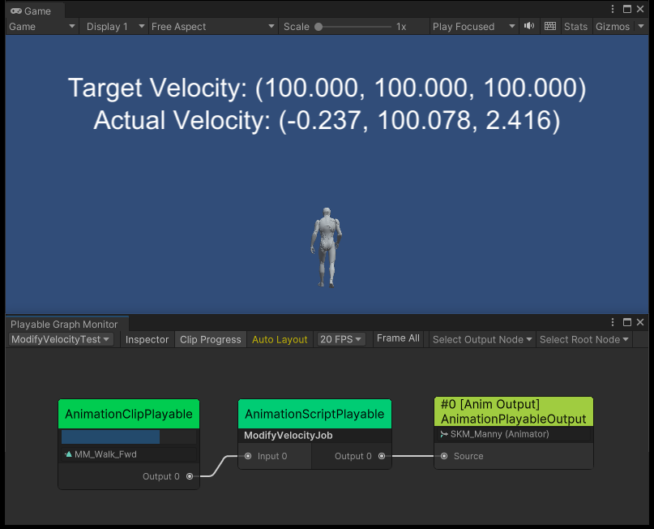

# Unity-Bug-Report-Playable-IN-41394

## About this issue

When using **humanoid** animation, modifying the `velocity` property through `AnimationStream` did not take effect as expected.

This issue does not arise when using **generic** animation.

## How to reproduce

1. Open the `SampleScene`.
2. Enter Play Mode.
3. In the Game view, you can see the "Target Velocity" and the "Actual Velocity" are different.

## Solution

TODO